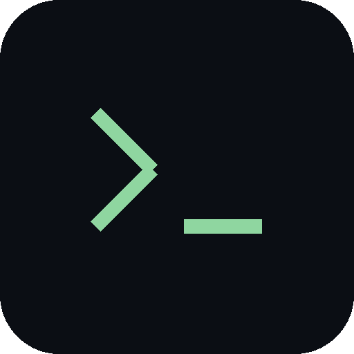
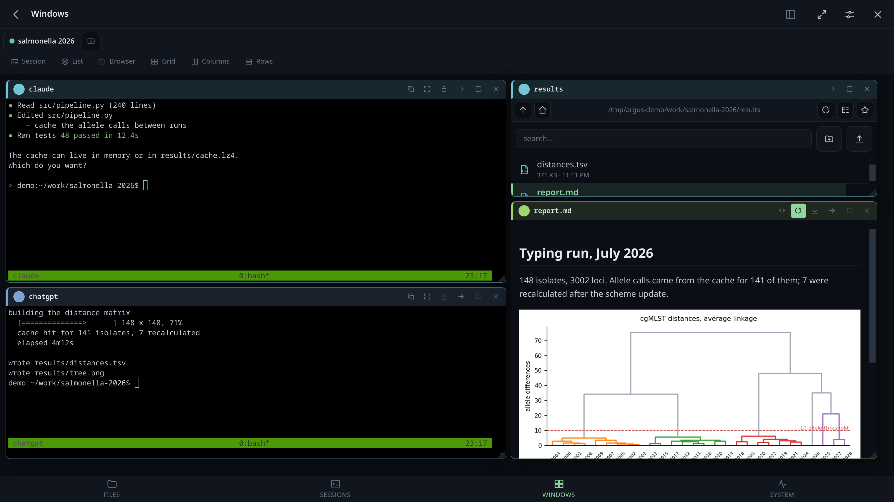
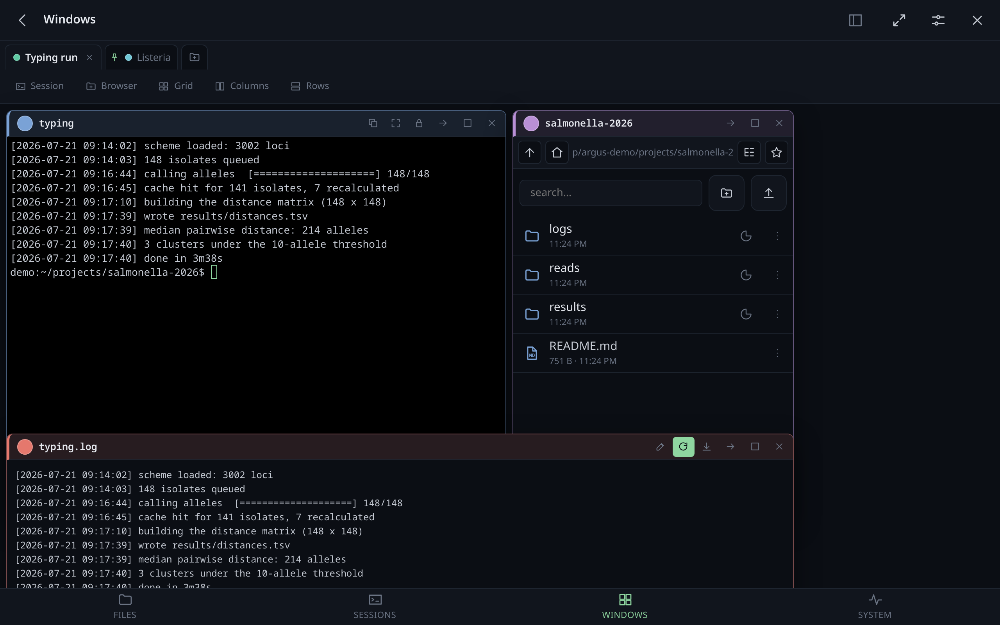
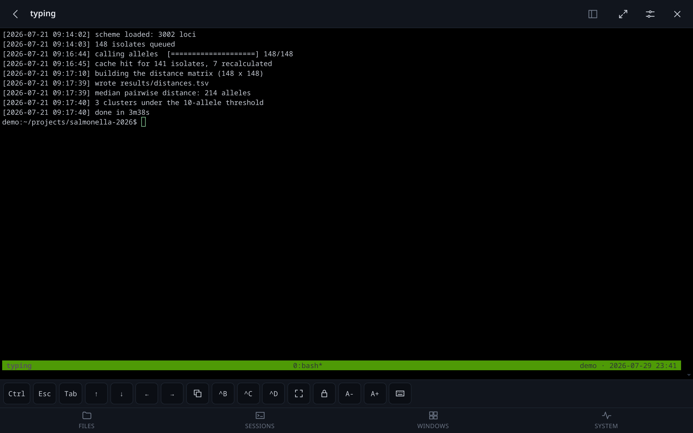
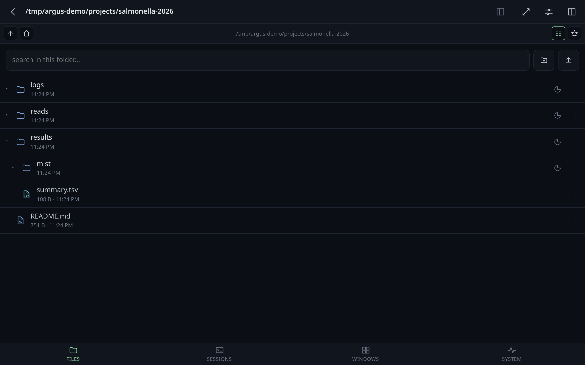
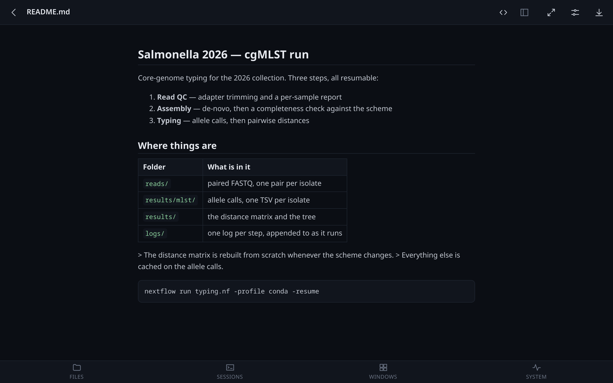
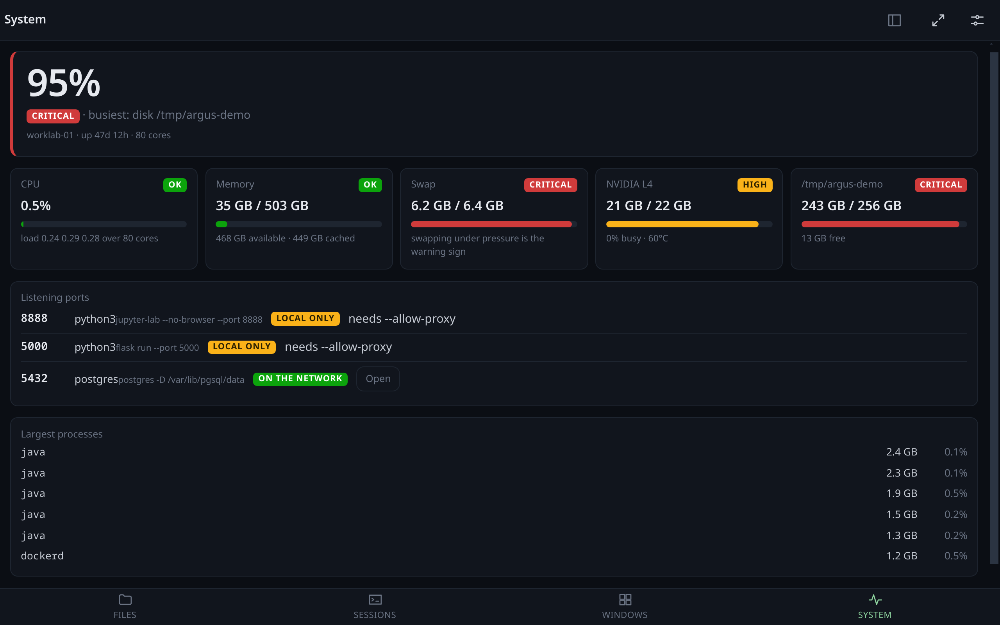
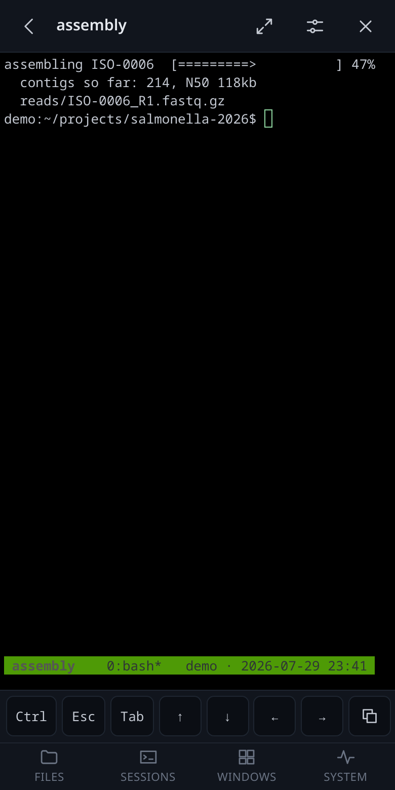

<div align="center">



# Argus

**The cockpit for work you no longer type yourself.**

*Your agents run in tmux. Argus is where you watch them, answer them, and look at what
they produced — the log, the plot, the report — from a desk or from a phone.*

**[argus, in one page →](https://andreaderuvo.github.io/argus/)**

[](https://github.com/andreaderuvo/argus/actions/workflows/tests.yml)
[](https://www.python.org/)
[](LICENSE)
[](#running-it)
[](#sessions-and-the-terminal)

*Named for the herdsman of a hundred eyes, who was set to watch and never slept.*

</div>

> [!WARNING]
> **Early days.** It is used daily on the machine it was written for, and it changes most
> days: expect rough edges, expect settings to move. More importantly, **Argus is remote
> shell access** — anyone with the token can run anything you can. Read
> [Security](#security) and [Reaching it from outside](#reaching-it-from-outside) before
> putting it anywhere but a trusted network.



## In a minute

```bash
pip install -r requirements.txt
python3 -m app.main --allow-write        # prints a URL with a token in it
```

Open that URL, or scan the QR code it can print, and the phone is in. That is the whole
setup: no build step, no database, no agent to install anywhere, and **nothing changes
about how you use tmux** — Argus attaches to the sessions you already have, the same way
another terminal window would, and leaves them running when you close the tab.

## Why this exists

An editor is built for the hours you spend writing code. More and more of that work is
now done by an agent that runs for two hours in a tmux session, and what is left for you
is a different job: keeping an eye on it, unblocking it when it asks something, and
judging what came out — the log, the table, the figure, the document.

That job needs almost nothing an editor is good at, and one thing it is bad at: being
somewhere else. The work carries on when you close the laptop, so the useful question is
what you can do from the train. Today the answer is an SSH client on a phone — a keyboard
that eats a third of the screen, a terminal that turns to confetti when you rotate it, no
way to look at the log *and* the plot at once, and no answer at all to "is the disk full
again?".

Argus is the other way round. The machine serves a small web app; the phone is just a
browser. You reattach to the session that was already running — not a new one — read what
it printed, answer it, and close the tab. The session never notices.

**The point is what sits next to the terminal.** An agent's output is mostly *references*
to things: a path it wrote, a report it generated, a number in a file. So the terminal and
the filesystem are the same room here:

- a path printed in the session is **clickable** — it opens beside the terminal, and the
  file browser jumps to it and marks it
- a file the agent writes **appears on its own**, without you refreshing anything
- the thing it wrote is **readable in place**: markdown with its figures, PDF with a
  search box, Word, images, a log that starts at the end
- a screenshot you paste lands in the folder you are looking at and **hands you back its
  path**, ready to paste into the session as the next instruction

None of this runs the agent or knows anything about it. Argus attaches to the tmux session
it already lives in, the way another terminal window would.

## What it is not

- **Not a tmux replacement.** It attaches as an ordinary client. Kill Argus and every
  session carries on; the app has no state your work depends on.
- **Not multi-user.** One token, one machine, one person's work. There are no accounts.
- **Not a hardened public service.** It is remote shell access wearing a browser. Run it
  on a LAN or behind a VPN, and read the [security](#security) section before anything
  else.

## Screenshots

| | |
|---|---|
|  |  |
| Windows you arrange yourself, snapping to each other | A real PTY, not a poll of `capture-pane` |
|  |  |
| Files as a list or a tree, with icons and sizes on demand | Markdown, PDF, Word, images, logs — rendered, not downloaded |
|  |  |
| CPU, memory, swap, GPUs, disks, listening ports | The same session, on the device you actually have with you |

<sub>The screenshots come from a demo instance with fabricated sessions, files and
services.</sub>

## Features

### Sessions and the terminal

- **Attach to the sessions that already exist**, or start new ones. Detaching leaves
  everything running; a dropped connection reattaches by itself.
- **A real pseudo-terminal.** `pty.openpty` → `login_tty` → `tmux attach`, so anything
  that works in a terminal works here: full-screen programs, colour, mouse mode.
- **Dragging a finger scrolls the session**, and the text keeps up with the thumb: the
  drag is turned into whole lines with the remainder carried, and how far tmux moves per
  wheel turn is *measured* rather than assumed — before that, a finger travelling ten
  lines sent the history forty-five lines away.
- **A key bar for what a phone has not got** — Esc, Tab, arrows, `^B` (the tmux prefix),
  `^C`, `^D`, and a sticky Ctrl for everything else.
- **Sizing you decide.** Two clients on one session cannot both pick the size, so the
  size is *claimed*: ⤢ takes it for the screen you are looking at, and the lock beside it
  says "I am only watching" — the desk keeps its geometry and the phone shrinks the type
  to fit the whole grid.
- **Copy out of tmux.** A selection made with tmux's mouse mode lands in a paste buffer
  on the server, where a browser cannot reach it. The copy button brings it to the
  clipboard of the device in your hand — even over plain HTTP, where the clipboard API
  does not exist.
- **Chain two sessions and type into both.** A chain button on each terminal; what you
  type in any chained window reaches all the others, Enter and Ctrl+C included. tmux's
  own `synchronize-panes` only spans the panes of one window and changes what every
  attached client sees — this crosses sessions and belongs to your browser alone. Chained
  windows are outlined and counted in the toolbar, because a broadcast you have forgotten
  about is the one genuinely dangerous thing in here.
- **Hand the work to the other agent.** Two agents on one machine share a filesystem, so
  what travels between them is not the work but a baton: a short sentence and a pointer.
  When one finishes — the bell knows — a button offers to type the sentence into the
  other's prompt, without an Enter. Two patterns, and they differ in behaviour rather
  than only in wording.

  It comes with **Referee** (one makes, the other reviews without editing and ends on a
  verdict; the return leg is a fix) and **Relay** (both improve the same work in turn),
  and you can save your own — a library that follows you between desks, **kept in groups**
  you name: *Paper review*, *Web development*, whatever you are doing, because a flat list
  of fifteen sentences is a list nobody reads. The sheet shows the groups first, then only
  the messages in the one you picked, and **what will actually be typed**, filled in,
  before anything is sent.

  Writing them has a screen of its own — **Prompts**, in the bottom bar — with
  full editing of the library: rename, duplicate, delete, and each one previewed with
  this desk's values as you type. The hand-over sheet is for sending; a place you pass
  through in a hurry is the wrong place to keep a library.

  Templates are written with **placeholders**. Three are filled in from the situation:
  `{folder}` — the *sending session's own working directory*, since a desk's folder says
  nothing about where tmux put the agent — plus `{from}` and `{to}`. They are defaults,
  not reserved words: define one in a set and yours wins, with the row saying what it is
  covering. The rest
  are yours, kept in **named sets**. `Default` is the ground truth; any other set says
  only what it changes and takes the rest from it, showing what it is covering — *instead
  of BMC Genomics* — and what it is inheriting, one tap to claim. A desk picks a set, from
  its own tab menu, so the same set serves every desk about
  the same thing instead of each desk keeping a copy of your name. A placeholder with nothing to put in it is
  flagged and passed through as written, where you can see it.

  **Or keep them open as a window.** A modal you open, aim and dismiss thirty times in an
  afternoon is thirty times too many, so *Prompts* is also a window on the desk: the
  folders, the messages, and you **drag one onto a terminal** — the same gesture as a path
  out of the link tray. Or just tap it: the window says at the top where a tap goes, and
  that follows the terminal you last touched, so the usual case is one tap and no question
  asked. Tap a name up there to aim it somewhere else and it stays put.

  **Hovering a prompt shows what it will actually say**, filled in, without sending it —
  and on the Prompts screen you can preview with any set of placeholders, not only the one
  the desk is on, since reading is not choosing.

  The ⋯ on a row is for the times a word needs changing before it goes: it shows the text
  filled in, lets you edit it once and sends it. Not saved — the library is edited where
  the library lives, where deleting one needs no confirmation: the row becomes a red line
  with **Undo** in it for five seconds, which is a better bargain than a dialog every
  time. Deliberately not a loop: automating the round trip is the part to add
  last, once the sentence has proved itself.
- **Clickable paths.** Hovering a line asks the server which of its words are real files;
  those get underlined, and opening one shows it in the viewer *and* points the file
  browser at it. Relative paths resolve against the pane's own working directory. On a
  phone, a long press does the same.

### Files

- Browse, search, rename, move, copy, delete, upload (drag and drop), make folders.
  All of it off by default: `allow_write` turns it on.
- **Paste a screenshot straight into a folder.** Ctrl+V in a listing writes the clipboard
  image where you are looking, named `screenshot-1.png`, `screenshot-2.png` — the number
  is the server's, so nothing is ever overwritten and two devices cannot collide.
- **List or tree**, hidden files on or off, favourites — kept on the server, so both
  devices see the same ones.
- **Two panes** side by side; either one can be a window in a workspace.
- **What a folder weighs**, on request: a button per folder, because finding out means
  walking it. It stops at 400k entries or twenty seconds and says "at least" rather than
  presenting a partial sum as the total.
- **Text files are editable**, with a save that refuses if the file changed underneath —
  the normal case when a job is writing to it.

### Documents

- **Markdown** rendered, with a source toggle, and the figures beside it on disk shown
  where they belong — `` resolves against the document's own folder.
- **PDF** in the browser's own viewer, with a search box that Argus answers itself:
  inside an iframe Ctrl+F searches the page around the document, and a phone has no
  Ctrl+F at all, so the text is extracted here and each hit jumps the viewer to its page.
- **Word/ODT/RTF** rendered through pandoc when the machine has it, with figures inlined
  — and the plain-text extraction as a fallback when it does not.
- **Logs**: a file too big to send whole arrives as its tail, which is the part anyone
  wants, and says so.
- Every previewed document is sandboxed into an opaque origin, so a stray HTML report
  cannot read the access token.

### Workspaces and windows

- **A new desk asks what goes in it**: the session list opens straight away and takes as
  many as you tick, rather than one at a time with the sheet closing after each. The same
  sheet adds sessions to a desk you already have.
- **Desks (tabs)** you can name, colour, reorder by dragging, and pin. Each holds its own
  set of windows, has its own address (`#/wall?ws=3`, copyable from the tab menu) and its
  own starting folder, and survives a reload. Every tab carries a **⋮** for its menu —
  holding it and right-clicking still work, but neither is a gesture anybody finds.
- **A desk's folder can be written with a placeholder** — `{folder}`, `{paper}` — filled
  from the set that desk is on, so a desk pointed at a project does not repeat what its
  set already says. The sheet shows what it resolves to as you type, and a placeholder
  with nothing to fill it sends browsers home rather than to a folder with a brace in its
  name.
- **A folder each desk starts in.** A desk is usually *about* something, so its browsers
  should land there rather than in the same home directory as everything else. Pick one
  of the shortcuts or type the path: it completes folder names as you go, Tab finishes
  the word the way a shell does, and a folder that is not there is refused rather than
  quietly stored.
- **Windows** for terminals, file browsers, documents and proxied web pages. Move or
  duplicate them between desks.
- **Magnetic layout**: windows snap to each other and to the wall's edges, with a preview
  of where the drop will land — including into the gap between two windows, which it
  fills exactly.
- **Shared edges behave as splitters**: widen one column and the next gives up precisely
  what the first one took.
- Tile as a grid, columns or rows when you want to start over.
- **A narrow window folds its own title bar**: below about 340px the buttons move into a
  ⋯, which reads them off the bar itself, so nothing runs past the edge on a phone. It is
  asked of the window, not the screen — a 300px window on a wide monitor has the same
  problem, and a media query cannot tell the two apart.
- **The window list says where each session actually is** — its tmux working directory,
  which is otherwise written down nowhere and is what a hand-over sentence points at.
- **Drag a line out of the tray onto a window**: onto a terminal it is typed into that
  session — with shell quoting, and without an Enter, because what to do with it is the
  point of handing it over; onto a file browser that folder is shown. Holding the line
  starts the drag on a phone too, so the list still scrolls. There is a copy button on
  each line for the times you want it on the clipboard instead.
- **Numbers where they are useful**: the Links button carries how many are waiting and
  moves as things are printed whether or not the tray is open; the List button carries how
  many windows the desk holds; the Sessions tab carries how many tmux sessions exist, and
  turns amber while one of them is waiting for you. All of them are about the desk you are
  on, so switching tabs shows that desk's own numbers.
- **A filter in the tray**, for when it holds thirty things and you want the one with
  `report` in it. It says how many of how many, and clearing it brings the rest back.
- **The tray can empty itself**: 1, 3, 5, 10, 30 minutes or never, per desk. It drops
  what is older than the span rather than wiping the lot on a timer, so a link that just
  arrived is never snatched away.
- **A link tray per desk.** What an agent produces is mostly *references* — where it
  wrote the report, what port it is serving on, which file failed — and by the time you
  have read the sentence it is four screens up. The tray catches every absolute path and
  URL that goes past in the desk's terminals and keeps them in a list you click. A path
  only earns a line if it is really there, so what collects is a short list of things
  that open, not everything that looked like a path. Empty it whenever it stops being
  useful.

### The machine

- CPU, load, memory, swap, GPUs (temperature and memory), every disk, and uptime — each
  with a plain reading of whether it is fine, and a note on *why* swap under pressure is
  the number that matters.
- **Listening ports**, with what is holding them. A service bound to `127.0.0.1` is
  unreachable from a phone by design; Argus will stand in front of it (`--allow-proxy`,
  then open that port by hand) and serve it under `/proxy/<port>/`.
- **Reach a port nobody found**, by typing its number: a service that has not started
  yet, or one the scan did not see. It appears in the list either way, so you can close
  it again.
- **Rescue a login that went to the wrong machine.** A tool running on the server starts
  a browser login whose callback is `http://localhost:1455/…`. You log in on your own
  laptop, where localhost is *your* laptop, and the callback lands on nothing. Paste that
  dead URL into the same box and Argus forwards it — path and query intact — to the port
  it was always meant for.
- Argus's own credentials stop at the proxy: neither the token in the query nor the
  `Authorization` header is passed to the service behind it.
- **Why not just forward the port, like VS Code?** Because VS Code has a piece running on
  your laptop that can open a socket there; a web page cannot, and no browser will ever
  let one. If you want `localhost:1455` to work literally, the tool VS Code uses under
  the hood is already on your machine: `ssh -L 1455:127.0.0.1:1455 you@server`. The proxy
  is the answer when all you have is a browser — a phone, a borrowed laptop — and the
  price is that the address changes.

### Being told when it is done

- **It has finished** and **it is waiting for you** are different events, and a
  notification that cannot tell them apart is noise by the end of the day. So nothing is
  guessed from the output: an agent hook posts to `/api/bell` and says which of the two
  it is. Claude Code's `Stop` and `Notification` hooks and codex's `notify` both do this
  in one line of configuration.
  **Settings has a button that does the wiring for you** — *Let your agents ring*. It
  writes the little script and adds the hooks to each agent's own configuration file,
  additively: an event you have already claimed is reported and left exactly as it was,
  a copy of each file as it was before Argus first touched it is kept beside it, and the
  same button takes it all back out. Agents read their configuration at startup, so it
  counts from the next one you open.
  `tools/argus-bell` in this repository is that one line: it reads the token from the
  config so no copy of it ends up in a hook, works out the tmux session by itself, and
  unwraps the JSON codex hands its notify program.
- **For everything that is not an agent**, the escape sequence every modern terminal
  implements: `OSC 9`. One `printf` at the end of a build, no configuration. Note that
  tmux swallows it unless it is wrapped in tmux's passthrough with
  `set -g allow-passthrough on` — measured, and the wiki has the shell function that gets
  it right in both cases.
- The window that rang is outlined, green for finished and amber for waiting; the tab of
  the desk holding it is marked; a message takes you there; two short tones you can turn
  off. Looking at the window is what stops it.
- **A bell per session.** Every terminal window carries one: lit means that session
  rings, struck through means it keeps quiet. Ringing for everything is the default,
  because a bell you have to switch on for each session is a bell that is silent the day
  you needed it — and silencing is a property of the session, so it holds wherever that
  session is shown and across reloads.
- **It works in another tab, over plain http.** Bells arrive on an open stream rather
  than by polling, because a background tab has its timers throttled to about once a
  minute — which is exactly the case that matters. The tab title changes to `● session`,
  a coloured dot is burnt onto the favicon (the part that survives a crowded tab strip,
  where the title is not shown at all), and the sound plays. None of the three needs a
  permission or a certificate.
- A notification from the browser itself does need a secure context, and Settings says
  so plainly instead of failing quietly. Three ways round it, in order of effort: declare
  the origin trusted in your own browser (`chrome://flags/#unsafely-treat-insecure-origin-as-secure`
  takes a full origin with its port; Firefox's `dom.securecontext.allowlist` takes bare
  hostnames and needs a second preference to stop it breaking images; Safari has no
  equivalent at all); put a real certificate in front (`tailscale serve`, or mkcert
  offline); or point the same hook at ntfy or Gotify as well — Argus does not try to be a
  push service. The wiki has the steps for each.

### Everything else

- **Ready-made looks for tmux**, from a button on the terminal itself — Argus, Paper,
  Amber, Slate, or Plain to undo them. **One session or all of them**: style options are
  session options, so a look can dress the window you are looking at and leave everybody
  else's alone, without writing anything to disk. Choosing "every session" writes it into
  the config instead, where it outlives a restart.
  Either way they set colours only — status line, borders, messages — never keys or
  behaviour, from a fixed list of options checked on the server, and the config route goes
  through the same throwaway-server check as anything else. A look cannot take a session
  down. The browser's own terminal is dressed to match, per session when that is what you
  chose.
- **Editing the tmux config** and handing it to every session at once. Sourcing a config
  *runs* it, so the file is tried on a throwaway tmux server first and only applied if it
  survives — a bad line ends the server it is sourced into, and that server holds all
  your work.
- **Four languages** (en, it, fr, es) and anyone can add a fifth: a catalogue is a flat
  JSON file keyed by the English strings, importable from Settings.
- **A phone-shaped interface**: bottom navigation, thumb-sized targets, drag-to-scroll in
  the terminal, a full-screen button (F11 is not on a phone), light and dark themes.
  Windows resize with a finger — the handles straddle the frame and are 34px at the
  corners on a touch screen, rather than the 8px strip outside it that a mouse is happy
  with and a thumb cannot find.
- **Keyboard shortcuts** for the places you go and the windows you open, with `?` for the
  list — and a key icon in the header, on screens wide enough to have a keyboard. Any of them can be changed — click the row, press the key — and Backspace clears
  one. They fire only when you are *not* typing: a terminal, or any box you are writing
  in, keeps the keyboard to itself, because stealing one key from tmux would be worse than
  having no shortcuts at all.
- **A QR code** to pair a phone, and an installable PWA over HTTPS.
- **The GitHub mark in the header** opens the repository, this wiki and the landing page,
  so the documentation is one tap from wherever you are rather than something you have to
  go and look for.
- **No build step.** The frontend is plain ES modules; xterm.js, marked and the QR
  library are vendored. `pip install -r requirements.txt` and run it.

## Reaching it from outside

Argus listens on plain HTTP and has one token. That is fine on a LAN or a VPN and not
fine on the open internet, so the question is how the phone gets to the machine. In rough
order of how little you have to think about it:

**Tailscale** — the one to pick for a phone. Install it on the machine and on the phone,
and they are on the same private network wherever either of them is. Then:

```bash
tailscale serve --bg 8090          # https://<machine>.<tailnet>.ts.net → your Argus
```

`serve` puts a real certificate in front of it, which also gets you the things HTTPS
unlocks: an installable PWA, the clipboard API, the in-app QR scanner. Nothing is exposed
to the internet — only devices on your tailnet can reach it. (`tailscale funnel` *does*
expose it publicly; don't, not with a shell behind it.)

**An SSH tunnel** — nothing to install anywhere:

```bash
ssh -N -L 8090:127.0.0.1:8090 you@machine     # then open http://127.0.0.1:8090
```

Perfect from a laptop, awkward from a phone.

**A reverse proxy with TLS**, if the machine already has a name and a certificate. Caddy
needs no WebSocket configuration:

```caddy
argus.example.com {
    reverse_proxy 127.0.0.1:8090
}
```

nginx does, and it needs the read timeout raised or a quiet terminal drops every minute:

```nginx
location / {
    proxy_pass http://127.0.0.1:8090;
    proxy_http_version 1.1;
    proxy_set_header Upgrade $http_upgrade;
    proxy_set_header Connection "upgrade";
    proxy_set_header Host $host;
    proxy_read_timeout 3600s;
}
```

Serve it at the **root of a name**, not under a path: the app asks for `/api/...`
absolutely, so `example.com/argus/` will not work. And if the proxy is reachable from the
internet, put a second lock in front — basic auth, an identity provider, Cloudflare
Access — because Argus's own lock is a single token with no rate limiting behind it.

**Cloudflare Tunnel** (`cloudflared tunnel --url http://127.0.0.1:8090`) works and takes
a minute, but it publishes a shell to the whole internet behind that one token. If you
use it, put Cloudflare Access in front of it.

## Running it

```bash
git clone <this repo> argus && cd argus
pip install -r requirements.txt
python3 -m app.main                        # 127.0.0.1:8080, read-only, prints a token
```

The first run writes `~/.config/argus/config.yaml` with a fresh token and prints the URL
to open. Useful flags — all of them also config keys:

```bash
python3 -m app.main \
  --listen 0.0.0.0:8090 \
  --root ~ --root /mnt/data \
  --allow-write \                # rename, move, delete, upload, save
  --allow-proxy \                # stand in front of loopback-only ports
  --include-mounts \             # offer every mount point as a root
  --socket my-tmux \             # a tmux socket other than the default
  --qr                           # print a QR code to photograph
```

| Key | Default | What it does |
|---|---|---|
| `listen` | `127.0.0.1:8080` | address and port |
| `token` | generated | 64 hex characters; the only credential |
| `roots` | `~` | the only paths that can be read at all |
| `allow_write` | `false` | every mutating file operation |
| `allow_proxy` | `false` | reverse-proxy a loopback port |
| `include_mounts` | `false` | add mount points to the roots |
| `tmux_socket` | tmux's default | which tmux server to drive |
| `resize_policy` | `adapt` | `adapt`, `preserve` or `auto` — who gets to set the window size |
| `max_preview_bytes` | 2 MiB | past this, a text file arrives as its tail |
| `max_upload_bytes` | 0 (no cap) | per uploaded file |

Run it under systemd so it survives logging out:

```ini
[Service]
ExecStart=/usr/bin/python3 -m app.main
WorkingDirectory=/path/to/argus
Restart=always
```

...plus `loginctl enable-linger $USER`, or the user manager stops at your last logout.

## Security

**Argus is remote shell access.** Anyone holding the token can run anything the user
running Argus can run. Treat it exactly like an SSH private key.

What protects it:

- **One token**, 64 hex characters from `secrets.token_hex`, compared in constant time.
  Every route and every WebSocket is behind it.
- **Safe defaults**: loopback only, read-only, no proxying, no extra mounts. Everything
  that can change the machine is opt-in.
- **A path jail** that canonicalizes before comparing, so neither `../../etc/passwd` nor
  a symlink pointing out of a root gets through. A path outside the roots is refused
  identically whether or not it exists, so the API cannot be used to probe the
  filesystem.
- **Previewed HTML and rendered documents** are served under a CSP sandbox, in an opaque
  origin, so somebody else's report cannot read the token out of localStorage. Markdown
  is escaped before rendering and `javascript:` links are stripped.
- **The tmux config is validated on a throwaway server** before being applied to the one
  holding your sessions.
- **The proxy keeps the token to itself.** A port has to be opened by hand before
  anything is forwarded to it, and what is forwarded carries neither the token in the
  query nor the `Authorization` header — a service behind the proxy, and its log, never
  see the credential.

What does not:

- **No TLS.** Over plain HTTP the token crosses the network in the clear and so does
  everything you type. On anything but a trusted LAN, put it behind a reverse proxy with
  a certificate, or reach it through a VPN or an SSH tunnel.
- **The token appears in the pairing URL**, so it lands in browser history and in server
  logs. Rotate it by editing the config and restarting.
- **No rate limiting, no audit log, no second factor.** One credential, no accounts.
- Anyone with the token can read every file under the configured roots, and — with
  `--allow-write` — change them.

## Development

```bash
python3 -m pytest -q          # 221 tests, no network, no tmux server of their own
```

The tests never touch tmux's default socket. Neither should anything else you run
against this code: a tmux server that dies takes every session on it with it, which is
how this repository learned the rule the hard way.

## Third-party code

Vendored under `static/vendor/`, unmodified, each keeping its own copyright header:

- [xterm.js](https://github.com/xtermjs/xterm.js) 6.0.0 — MIT
- [marked](https://github.com/markedjs/marked) 18.0.7 — MIT
- [qrcode-generator](https://github.com/kazuhikoarase/qrcode-generator) 2.0.4 — MIT

Optional at runtime: [pandoc](https://pandoc.org) for Word documents, and `pdftotext`
(poppler) to search inside PDFs. Without either, those files still open — they are just
plainer.

## Licence

MIT — see [LICENSE](LICENSE).
