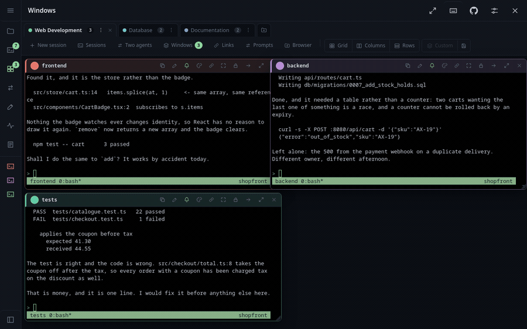

<div align="center">


# Argus

**Watch your AI agents work. From anywhere.**

They already run in tmux — Claude Code, Codex, Gemini, a script that takes two hours.
Argus puts those sessions, the files they are writing and the report they just produced in
one browser tab, and the same thing on your phone. Nothing to install inside the agent: if
it runs in a terminal, it works.



*Three agents on one job: a Claude on the frontend, a Codex on the API, a Claude running
the tests — and the tester has found what the other two missed. The files they are writing
sit beside them, and the next desk is one press away.*

[](https://github.com/andreaderuvo/argus/actions/workflows/tests.yml)
[](https://www.python.org/)
[](LICENSE)
[](https://github.com/andreaderuvo/argus/wiki/Getting-started)
[](https://github.com/andreaderuvo/argus/wiki/Sessions-and-the-terminal)

**[See it in one page →](https://andreaderuvo.github.io/argus/)**  ·  **[Read the
wiki →](https://github.com/andreaderuvo/argus/wiki)**

</div>

## Run it

```bash
git clone https://github.com/andreaderuvo/argus && cd argus
pip install -r requirements.txt
python3 -m app.main --allow-write        # prints a URL with a token in it
```

Open the URL it prints. Python 3.11+, tmux, three dependencies, no build step and no
database; `--qr` prints a code to photograph with a phone. The first run writes
`~/.config/argus/config.yaml` with a fresh 64-character token, which is the only
credential there is.

> [!WARNING]
> **This is remote shell access wearing a browser.** Anyone holding the token can run
> anything you can. Put it on a LAN, behind a VPN, or through an SSH tunnel — never on the
> open internet. [Security](https://github.com/andreaderuvo/argus/wiki/Security) says what
> protects it and what does not, and [Reaching it from
> outside](https://github.com/andreaderuvo/argus/wiki/Reaching-it-from-outside) has the
> ways in that are safe.

## Where everything else is

The [wiki](https://github.com/andreaderuvo/argus/wiki) is the documentation. It used to all
be in this file, which meant the answer to "what is this" arrived a thousand lines before
you could read it.

| | |
|---|---|
| [Getting started](https://github.com/andreaderuvo/argus/wiki/Getting-started) | installing, the config file, running it as a service |
| [Sessions and the terminal](https://github.com/andreaderuvo/argus/wiki/Sessions-and-the-terminal) | attaching, typing, copying, prompts, placeholders |
| [Files](https://github.com/andreaderuvo/argus/wiki/Files) and [Documents](https://github.com/andreaderuvo/argus/wiki/Documents) | browsing, editing, uploading; markdown, PDF, Word, logs |
| [Desks and windows](https://github.com/andreaderuvo/argus/wiki/Desks-and-windows) | workspaces, arrangements, the link tray |
| [Two agents on one job](https://github.com/andreaderuvo/argus/wiki/Two-agents) | the two patterns, the bridge file, the review loop |
| [Notifications](https://github.com/andreaderuvo/argus/wiki/Notifications) | being told when it has finished, or when it wants you |
| [Keyboard shortcuts](https://github.com/andreaderuvo/argus/wiki/Keyboard) | the keys, and how to change them |
| [What each agent can do](https://github.com/andreaderuvo/argus/wiki/Agents) | who rings, who can say which folder and model it is on |
| [Security](https://github.com/andreaderuvo/argus/wiki/Security) | the token, the file jail, per-device keys, the journal |
| [The API](https://github.com/andreaderuvo/argus/wiki/The-API) | everything the app does, a script can do |
| [Everything it does](https://github.com/andreaderuvo/argus/wiki/Everything-it-does) | the whole catalogue, one page, searchable |
| [FAQ](https://github.com/andreaderuvo/argus/wiki/FAQ) and [Troubleshooting](https://github.com/andreaderuvo/argus/wiki/Troubleshooting) | the questions people actually ask |
| [Development](https://github.com/andreaderuvo/argus/wiki/Development) | the tests, the three scripts, the vendored code |

## Licence

MIT — see [LICENSE](LICENSE). Vendored under `static/vendor/`, unmodified: xterm.js, marked
and qrcode-generator (MIT), highlight.js (BSD-3-Clause), each keeping its own licence beside
it.

---

<div align="center">

**Argus** is one machine. **[Panoptes](https://github.com/andreaderuvo/panoptes)** is the
board over several of them: every machine on one page, which sessions are on each, and
which one is waiting for you.

</div>
