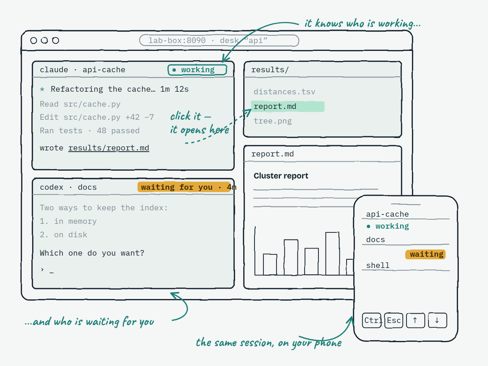
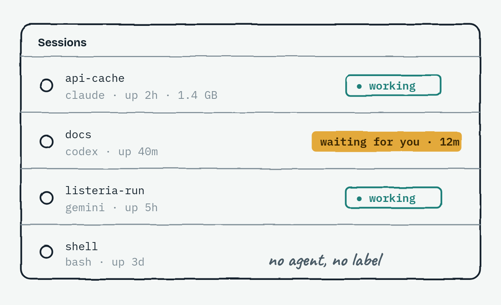
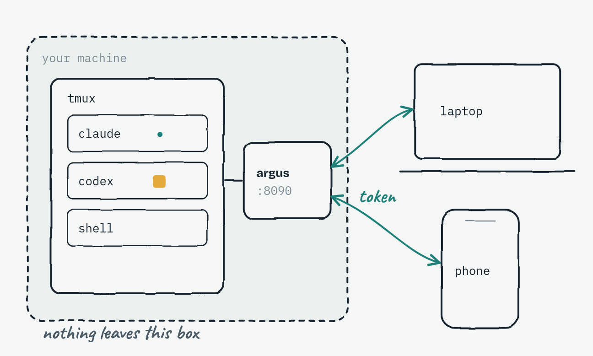
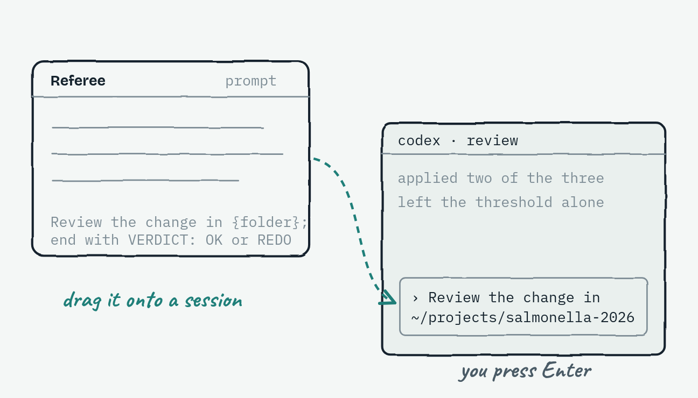

<div align="center">


# Argus

**A hundred eyes on your AI agents.**

A web workspace for the coding agents you already run in tmux. See which one is working and
which is waiting for you, open what it wrote in one click, and answer from your phone.

[](https://github.com/andreaderuvo/argus/actions/workflows/tests.yml)
[](https://github.com/andreaderuvo/argus/actions/workflows/install.yml)
[](https://www.python.org/)
[](LICENSE)

**[Website](https://andreaderuvo.github.io/argus/)** · **[Install](#install)** ·
**[Documentation](https://github.com/andreaderuvo/argus/wiki)**

<picture>
  <source media="(prefers-color-scheme: dark)" srcset="docs/img/sketch-desk-dark.png">
  
</picture>

<sub>A sketch, not a screenshot: every name in it is made up.</sub>

</div>

<sub><code>1:why*</code></sub>

## Agents work for minutes. Then they stop and wait for you.

You find out forty minutes later, over ssh, squinting at a pane. Argus takes care of the part
of the job that is not typing: knowing, seeing, answering.

- **Know when one needs you.** Every session says *working* or *waiting for you*, worked out
  from the pane itself. There is nothing to install in the agent; an optional one-line hook
  lets it ring you as well, with ntfy delivery when the browser is closed.
- **See what it produced.** Every path an agent prints is a link. Markdown, PDF, Word, images,
  logs and source open beside the session that made them, already rendered.
- **Answer from anywhere.** The same sessions, still running, on your phone, with a key bar for
  Ctrl, Esc and the arrows. Close the tab and the work carries on.

<p align="center">
<picture>
  <source media="(prefers-color-scheme: dark)" srcset="docs/img/sketch-sessions-dark.png">
  
</picture>
</p>

<sub><code>2:how*</code></sub>

## It attaches to the sessions you already have.

Argus is one more client of your tmux server. It does not wrap your agent or move your work,
and closing the browser never stops anything. Stop Argus itself and every session carries on.

1. **Install it where your agents run**: a workstation, a server, a box in a cloud.
2. **Open the link it prints.** It carries a private token, and `--qr` prints a QR code for the
   phone. There is no account.
3. **Your sessions are already there**, with their files and reports. You can start new agents
   from the page too, with their first instruction typed in.

<p align="center">
<picture>
  <source media="(prefers-color-scheme: dark)" srcset="docs/img/sketch-how-dark.png">
  
</picture>
</p>

<sub><code>3:hand-offs*</code></sub>

## Pass work from one agent to the next.

Keep prompts in a library, with placeholders filled in for each project. Drag one onto a
session and it is typed there; the Enter is left for you.

- **Desks, not tabs**: terminals, folders and documents side by side, one desk per project,
  kept between visits.
- **Start an agent from the page**: a shell or an agent from your own list, in a folder, with its
  first instruction, and if you want in a fresh git worktree so two agents never edit one tree.
- **Two agents on one job**: a worker and a reviewer, talking through a file you can read.

<p align="center">
<picture>
  <source media="(prefers-color-scheme: dark)" srcset="docs/img/sketch-handoff-dark.png">
  
</picture>
</p>

<sub><code>4:more*</code></sub>

## Everything an agent's work points at.

| | Argus | Agent-specific remote control | Browser terminal |
|---|---|---|---|
| Existing tmux sessions | Yes | Usually no | Sometimes |
| Claude Code, Codex, Gemini and any CLI | Yes | One ecosystem | Yes |
| Working / waiting, without a hook | Yes | Its own agent only | No |
| Files and rendered reports beside the terminal | Yes | Limited | No |
| Hand-offs between agents, git worktrees | Yes | No | No |
| Self-hosted, no account or cloud relay | Yes | No | Varies |

Also: a file browser that updates when a job writes into a folder; the machine's CPU, memory,
GPUs, disks and biggest processes, which you can label; local ports reachable from the phone if
you allow it; and an API that lets scripts and agents do what the page does.
[Everything it does, in detail.](https://github.com/andreaderuvo/argus/wiki/Everything-it-does)

<sub><code>5:install*</code></sub>

## Install

Argus needs Python 3.11+ and tmux. Linux and macOS run it natively; Windows runs it inside WSL.

**Installer.** Read the script, then run it:

```bash
curl -fsSLO https://raw.githubusercontent.com/andreaderuvo/argus/master/install.sh
less install.sh
bash install.sh
argus --allow-write          # prints a URL with a token in it
```

It installs under `~/.local/share/argus`, uses no `sudo`, and keeps its configuration in
`~/.config/argus`. Run it again to update, add `--service` for a systemd user service, or run
`bash install.sh uninstall` to remove it.

**From source.**

```bash
git clone https://github.com/andreaderuvo/argus.git && cd argus
python3 -m venv .venv && . .venv/bin/activate
pip install -r requirements.txt
python -m app.main --allow-write
```

**Container.**

```bash
ARGUS_UID=$(id -u) ARGUS_GID=$(id -g) docker compose up -d
docker compose logs argus
```

The container is packaging, not a sandbox: to reach the host's tmux sessions it needs the host
tmux socket, the matching user ID, the process namespace and the home-directory path. Read the
[container notes](docker-compose.yml) first. Versioned `amd64`/`arm64` images are public at
[`ghcr.io/andreaderuvo/argus`](https://github.com/andreaderuvo/argus/pkgs/container/argus).

<sub><code>6:safe*</code></sub>

## Safe by default

> [!WARNING]
> Argus is remote shell access in a browser. Anyone holding a full access token can act as the
> account running it. Keep it on loopback, a trusted LAN, a VPN such as Tailscale, or an SSH
> tunnel. Never expose its HTTP port directly to the public internet.

Argus starts on `127.0.0.1`. File writes and the local-port proxy are off unless you turn them
on, paths are confined to the folders you name, and each phone can hold its own revocable token.
Separate restricted tokens let agents ring, ask questions and hand off work without getting
browser or shell access. Nothing is sent to a cloud.

Read the [security model](https://github.com/andreaderuvo/argus/wiki/Security) and the
[vulnerability policy](SECURITY.md) before making it reachable from another machine.

<sub><code>7:fleet*</code></sub>

## Several machines: Panoptes

Argus is the workspace for one machine. **[Panoptes](https://github.com/andreaderuvo/panoptes)**
is one page over all of them, ordered by which one needs you. It holds restricted watcher keys
and never sends a machine key to the browser. Use Argus alone first; add Panoptes when one tab
per machine stops scaling.

<sub><code>8:status*</code></sub>

## Project status

Argus is pre-1.0 and used every day. Each change runs the test suite on every supported Python
version, a real-browser suite that drives the interface at desktop and phone size, and the
installer on Linux and macOS. Configuration keys and API shapes may still change between minor
releases; the tmux sessions and files it watches never depend on Argus.

[Changelog](CHANGELOG.md) · [Roadmap](https://github.com/andreaderuvo/argus/milestone/1) ·
[Documentation](https://github.com/andreaderuvo/argus/wiki) ·
[API reference](https://andreaderuvo.github.io/argus/api.html) ·
[Report a bug](https://github.com/andreaderuvo/argus/issues/new?template=bug_report.yml) ·
[Contribute](CONTRIBUTING.md)

If Argus helps you, a star helps other people find it. Telling us what confused you or broke on
your machine helps even more.

## License

MIT. Vendored browser libraries keep their upstream MIT, BSD-3-Clause or Apache-2.0 licenses
under `static/vendor/`.
