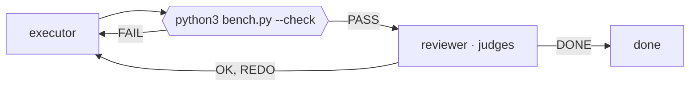

# Writing an Argus team

A team is a **graph**: steps (agents, checks, joins, the end) and arrows saying who goes next and
when. Argus runs it on the server: it starts each agent on its turn, runs the checks, follows the
arrows by the results. You **write** the team, **check** it, and **propose** it. Only the person
starts it — never promise that it is running.

## The three moves

1. **Write it** — as a Mermaid flowchart (short, drawn by GitHub too) or as YAML (everything,
   duties included). Ask yourself first: what is the goal, what decides that a change is good (a
   command with an exit code is best), who judges, where does a failure go back to.
2. **Check it** — the tool `team_check` with the text (or `argus-say team-check team.mmd`). It
   answers `OK` with a one-line summary, or the line that is wrong. Fix and check again.
3. **Propose it** — `team_propose` with the text and the project's folder (absolute). Argus writes
   it as `<folder>/team.yaml` and rings the person; their tap opens Team on it. Then tell them in
   one line what you proposed and stop: you do not wait for it.

## Mermaid



| Write | Means |
|---|---|
| `flowchart LR` | the first line (`graph TD` works too) |
| `%% name: …`, `%% goal: …` | the team's name and goal (comments: Mermaid ignores them) |
| `id["role"]` | an **agent** step; the label is its role |
| `id["role · judges"]` | an agent that **judges** (the word *judges* anywhere in the label) |
| `id{{"command"}}` | a **check**: a shell command run in the project; exit 0 = PASS. Its work is the agent pointing into it |
| `id{join}` | a **join**: waits for every arrow coming in |
| `done` | the end |
| `a --> b` | always |
| `a -->\|PASS\| b`, `a -->\|OK, REDO\| b` | only on that result (several with commas) |
| `a --> b --> c`, `a --> b & c`, `b & c --> j` | chains, parallel branches, joining them |
| `%% start: a, b` | where it starts (default: the first step written) |

Ids: letters, digits, `-`, `_`, starting with a letter. A duty, a worktree or `reads` cannot be
said in Mermaid — use YAML when they matter.

## YAML

```yaml
name: Faster parser
goal: make parse() 30% faster without changing its output
gate: ask            # ask (a press per round) | auto (stops on 2 failed checks or BLOCKED) | goal
rounds: 8            # at most (1–30, default 10)
permissions: edit    # ask | edit | everything — a suggestion; the person sees it before Start
steps:
  plan:  {role: planner}
  a:     {role: executor, worktree: true, duty: "Try the idea the planner gives you first."}
  b:     {role: executor, worktree: true, duty: "Try the second idea."}
  bench-a: {check: python3 bench.py --check, of: a}
  bench-b: {check: python3 bench.py --check, of: b}
  both:  {join: true}
  rev:   {role: reviewer, judge: true, reads: [a, b], duty: "Keep the faster one that passes."}
flow:
  - plan -> a, b
  - a -> bench-a
  - b -> bench-b
  - bench-a -> both
  - bench-b -> both
  - both -> rev
  - rev -> plan if OK, REDO
  - rev -> done if DONE
```

Step keys: `role`, `judge`, `duty` (its job in your words — may name the agent's own skills,
"use your /security-review skill"), `worktree` (its own git checkout on branch
`team/<team>-<step>`, so parallel executors never collide), `reads` (whose worktree it should look
at); a check is `check: <command>` and `of: <agent>`; a join is `join: true`. Flow lines are
`a -> b`, `a -> b, c` (parallel) and `… if PASS` / `if FAIL` / `if OK, REDO` / `if DONE` /
`if BLOCKED`. `start: [a]` when it is not the first step.

## Roles, verdicts, results

- **Roles** with a ready duty: `planner`, `executor`, `reviewer`, `researcher`, `writer`,
  `critic`, `tester`. Any other word is fine; then give it a `duty`.
- A **judge** ends its turn with **OK** (keep it, go on), **REDO** (say what is wrong), **DONE**
  (the goal is met), **BLOCKED** (a person must decide). Arrows out of a judge carry those.
- A **check** gives **PASS** or **FAIL**. Arrows out of a check carry those.
- A **round** is one pass: going back to a step that already ran this round starts the next.

## Rules Argus checks (team_check says which one)

- 1–12 steps, at most 8 agents; every arrow goes to a step that exists.
- No step loops into itself on `always` (it would never stop); a join must have arrows into it.
- Something must start, and something should reach `done` — without it the team runs until the
  rounds are spent.

## Good teams

- **Let numbers decide.** A check with an exit code (tests, a benchmark with a threshold) beats a
  reviewer's opinion. Put it right after whoever changes code, and send FAIL straight back to them.
- **One judge**, at the end of the round. Two critics in parallel → a join is fine for writing.
- **Parallel executors get `worktree: true`** — or a planner that gives each its own files.
- **Small.** Two or three agents and a check do most jobs; a graph of eight is hard to watch.
- **The folder** is the project's root (where the check runs). It must exist.
- Do not propose `permissions: everything` unless asked: it runs agents with no questions.
